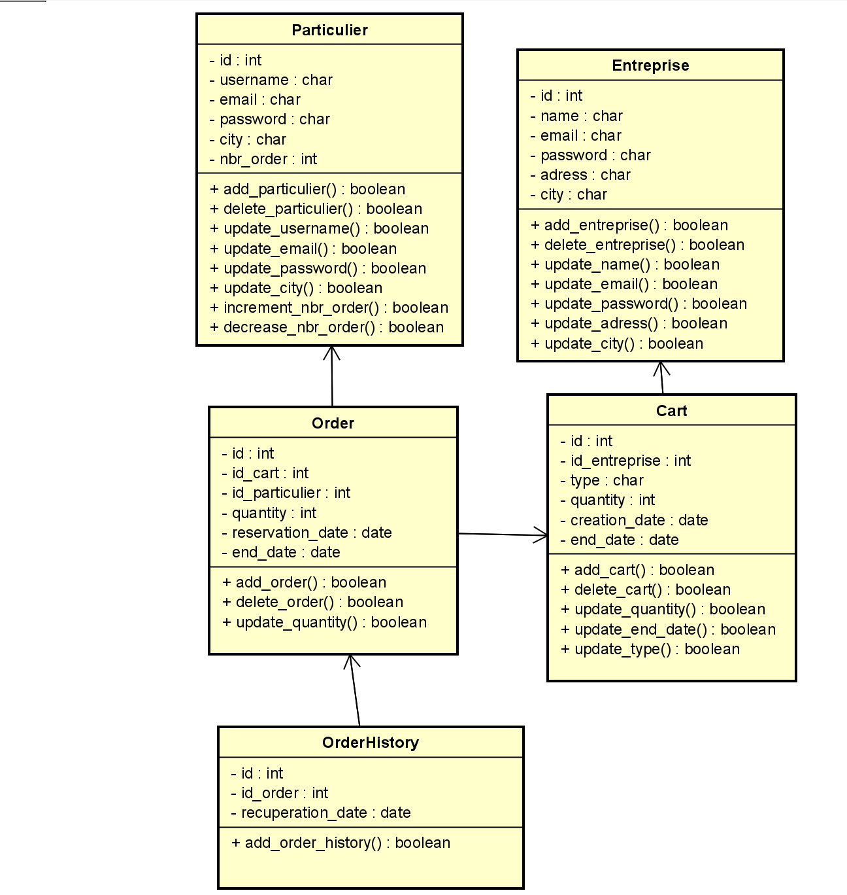

# Contexte
## Data modeling
 
Afin de remplir notre base de données, nous avons créer un [script](./create_dataset.py) pour générer des données. Dans le dossier [data](./data), il y a un fichier csv correspondant à chaque table.

## Principe
Un 'Entreprise' peut publier un 'Cart'. Un Particulier peut réserver un 'Cart' en précisant 'quantity' en fonction de 'Cart.quantity' qui diminue. Cette opération crée un ligne dans 'Order'. Lorsque 'Particulier' récupère son 'Order', on ajoute une ligne dans OrderHistory en précisant recuperation_date

# Objectif
* Entrainer un model de machine learning qui permettra à un 'Entreprise' de savoir quelles sont les chances pour que 75% de 'Cart.quantity' d'un 'Cart' soient récupérés : [Model](./predict_taken_at_75_proba.ipynb)
* Entrainer un model de machine learning qui permettra à un 'Entreprise' de savoir combien de 'Cart.quantity' d'un 'Cart' seront récupérés : [Model](./predict_how_many_taken.ipynb)

# Utilisation
Les résultats de ces modèles permettront aux 'Entreprise' d'optimiser le 'Cart.quantity' de 'Cart' qu'ils publient en fontion des autres champs de 'Cart'

# Récupération des données
Pour ces modeles, nous auront besoin des champs suivant:
* cart_type: le type de panier
* entreprise_email: email de l'entreprise
* entreprise_name: le nom (franchise) de l'entreprise
* entreprise_city: la ville de l'entreprise
* day_publication: le jour (jour de la semaine: Lundi au Dimanche) de publication du panier
* month_publication: le mois de publication du panier
* hour_publication: l'heure de publication du panier
* quantity_published: la quantité lors de la première publication du panier
* quantity_reserved: la quantité total réservée sur un panier
* quantity_take: la quantité total récupérée sur un panier

Un [dataset](./data/Prediction.csv) a été crée sur cette base à partir des fichiers csv corresdants aux tables (dans le dossier data). Le script de création de ce dataset se trouve [ici](./create_prediction_dataset.ipynb)