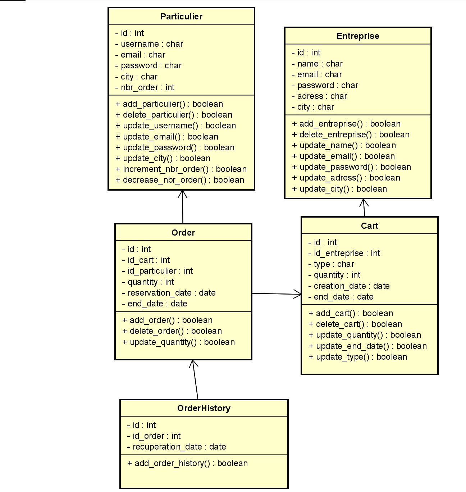
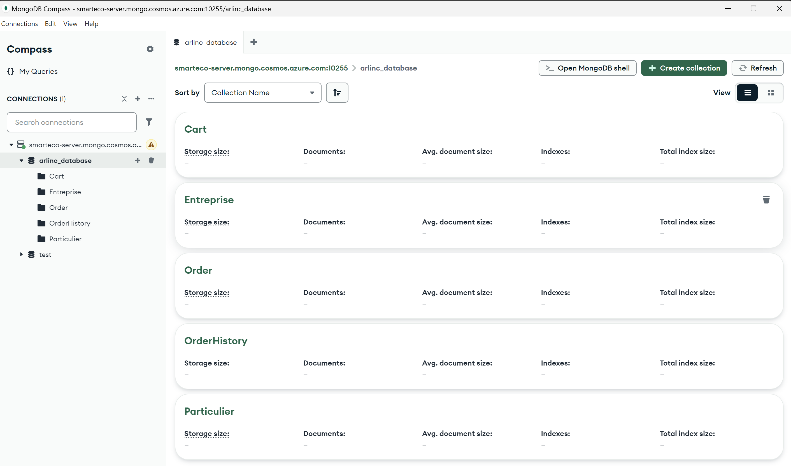
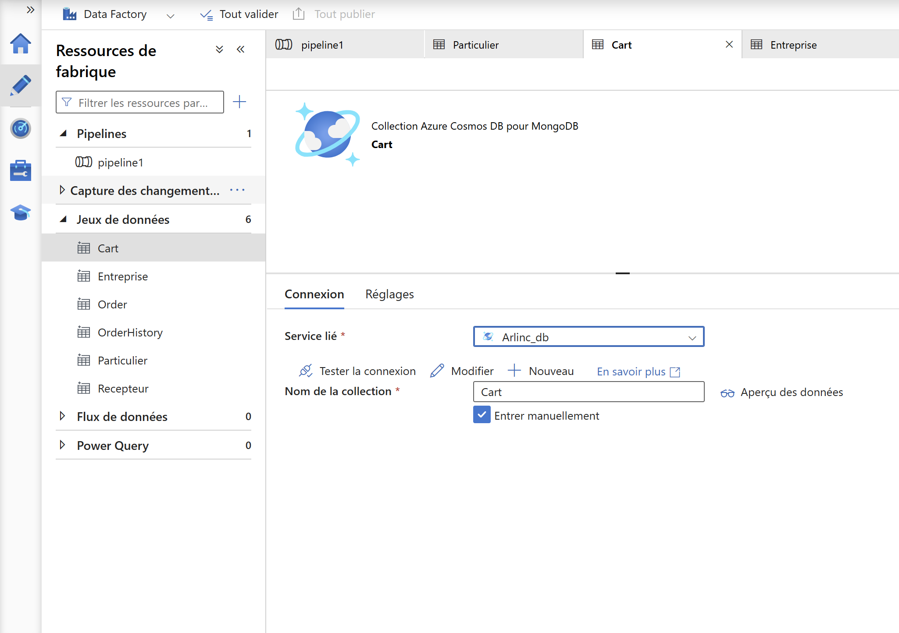
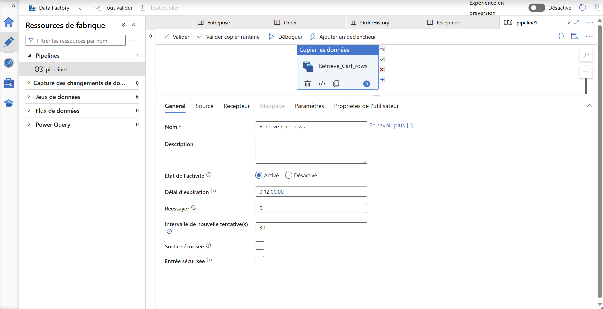
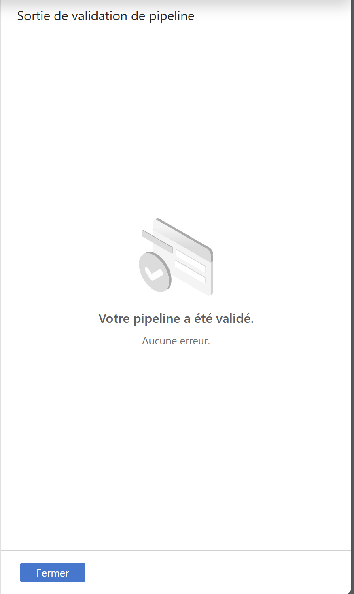

# Contexte
## Data modeling
<br>

## SGBD
Nous sommes parties sur une base de donnée NoSQL créée avec Azure Cosmos DB for MongoDB. Notre base de donnée principale sera: arlinc_database
<br>

# Objectif
Créer une pipeline de donnée pour créer le dataset à utiliser pour l'entrainement des modèles prédictifs

# Développement
## Création d'un Azure Data Factory
Nous l'appellerons SmartEco-DataFactory

## Importation des collections de arlinc_database sur SmartEco-DataFactory
<br>
Comme vous pouvez le voir sur l'image ci-dessus, nous avons importer les toutes les collections. Nous avons également créer une collection Recepteur où seront stockées les données récupérées grâce au pipeline.

## Création du pipeline
### Copier la table Cart
<br>
Pour commencer nous copions tous les documents de la collection Cart dans Recepteur. Ci-après le code source:
```yml
{
    "name": "Retrieve_Cart_rows",
    "type": "Copy",
    "dependsOn": [],
    "policy": {
        "timeout": "0.12:00:00",
        "retry": 0,
        "retryIntervalInSeconds": 30,
        "secureOutput": false,
        "secureInput": false
    },
    "userProperties": [],
    "typeProperties": {
        "source": {
            "type": "CosmosDbMongoDbApiSource",
            "batchSize": 100
        },
        "sink": {
            "type": "CosmosDbMongoDbApiSink",
            "writeBatchTimeout": "00:30:00",
            "writeBehavior": "insert"
        },
        "enableStaging": false
    },
    "inputs": [
        {
            "referenceName": "Cart",
            "type": "DatasetReference"
        }
    ],
    "outputs": [
        {
            "referenceName": "Recepteur",
            "type": "DatasetReference"
        }
    ]
}
```
En l'executant nous avons ceci:
<br><br>